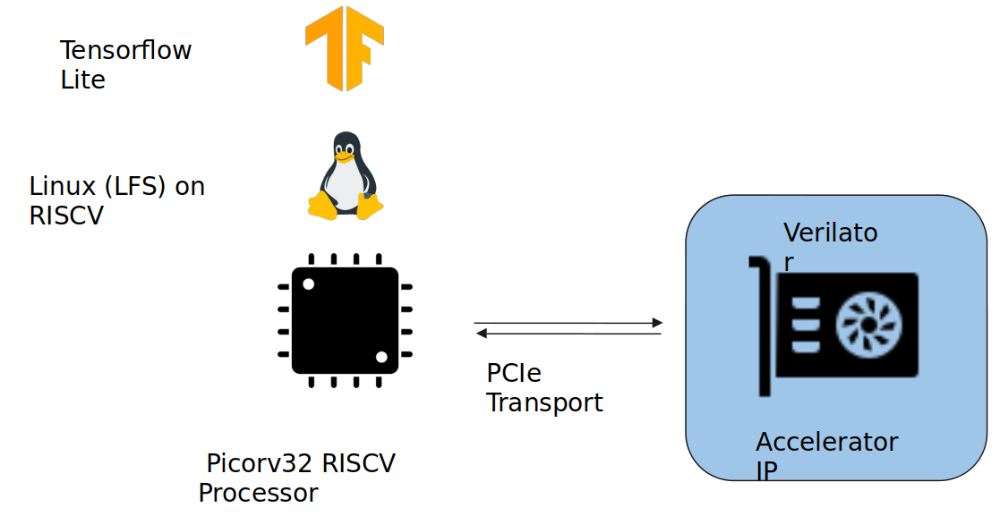

# A Hierarchical Mesh-based Machine Learning Inference Accelerator - Final Bachelor's thesis at College of Engineering Guindy, Anna University.
Inspired by Eyeriss architecture[1]

## Contributors
 - Karthikeyan Renga Rajan
 - Arjun C
 - Preethaa J

## Motivation
 - AI plays a quintessential role in today’s world.
 - The algorithms in use are compute-intensive.
 - There is a need to accelerate this process.

## Aim
To design a Machine Learning Inference accelerator that will be used in edge devices. 

## Objective
Improve upon existing architectures by optimizing their design and including original ideas.

## Work Progress

## Architecture - Processing Element

## Architecture - Top Level

## Approximate Multipliers
 - These are a class of multipliers that improve on speed, power consumption and space with a trade-off in accuracy.
 - These multipliers involve rounding off numbers to the nearest 2^(whole number) and using left shifts and adders to perform the multiplication operation.

## Dynamic Range Unbiased Multiplier

## Operand Modification

## PE Final Architecture

## RTL Design

## Integration Testing Architecture

## Verilator Functional Verification

## Gaussian Blur - Basic Convolution test

## Integration Testing

## Integration Testing (Linux Execution Trace): SW Only

## Integration Testing (Linux Execution Trace): SW+HW

## Optimization on Dataflow

## References
1) Y. -H. Chen, T. Krishna, J. S. Emer and V. Sze, "Eyeriss: An Energy-Efficient Reconfigurable Accelerator for Deep Convolutional Neural Networks," in IEEE Journal of Solid-State Circuits, vol. 52, no. 1, pp. 127-138, Jan. 2017, doi: 10.1109/JSSC.2016.2616357.
2) Yang, Yu-Hsin, et al. "Eyeriss v2: A Flexible Accelerator for Emerging Deep Neural Networks on Mobile Devices." 2019 IEEE International Solid-State Circuits Conference (ISSCC). IEEE, 2019, pp. 394-396.
3) Vuduc, Richard & Chandramowlishwaran, Aparna & Choi, Jee & Efe, Murat & Guney, Murat & Shringarpure, Aashay. “On the Limits of GPU Acceleration”. (2010).
4) Tiwari, Devesh, Gupta, Saurabh, Rogers, James H, Maxwell, Don E, Rech, Paolo, Vazhkudai, Sudharshan S, Oliveira, Daniel, Londo, Dave M, DeBardeleben, Nathan, Navaux, Philippe, Carro, Luigi, and Bland, Arthur S Buddy. Understanding GPU Errors on Large-scale HPC Systems and the Implications for System Design and Operation. United States: N. p., 2015. Web.
5) E. BUBER and B. DIRI, "Performance Analysis and CPU vs GPU Comparison for Deep Learning," 2018 6th International Conference on Control Engineering & Information Technology (CEIT), Istanbul, Turkey, 2018, pp. 1-6, doi: 10.1109/CEIT.2018.8751930.
6) Norman P. Jouppi, et. al. “In-Datacenter Performance Analysis of a Tensor Processing Unit”. In Proceedings of the 44th Annual International Symposium on Computer Architecture (ISCA '17). 2017. Association for Computing Machinery, New York, NY, USA, 1–12. https://doi.org/10.1145/3079856.308024.
7) Yongmei Zhou and Jingfei Jiang, "An FPGA-based accelerator implementation for deep convolutional neural networks," 2015 4th International Conference on Computer Science and Network Technology (ICCSNT), Harbin, China, 2015, pp. 829-832, doi: 10.1109/ICCSNT.2015.7490869.
8) Raju Machupalli, Masum Hossain, Mrinal Mandal, “Review of ASIC accelerators for deep neural network”, Microprocessors and Microsystems, Volume 89, 2022, 104441, ISSN 0141-9331, https://doi.org/10.1016/j.micpro.2022.104441.
9) Kwon, Hyoukjun & Samajdar, Ananda & Krishna, Tushar. (2018). “MAERI: Enabling Flexible Dataflow Mapping over DNN Accelerators via Reconfigurable Interconnects”. pp. 461-475. doi: 10.1145/3173162.3173176

